# Final 24 adjacent alignment pairs

These are the saved final `pairs/*/qc.png` images, including the accepted revisions for 014→007, 025→020, 044→039 and 049→044. No historical candidate images are substituted.

Direction: source → target; input consists of the original full-frame images Xt/Yt. The "px" labels in the figures reflect the registration output, with numerical values ​​corresponding to the Xt/Yt units specified in the CSV. Only the final images are compiled here; pairs already verified by the user are not re-evaluated.

## 007_to_002 · -79.738293°

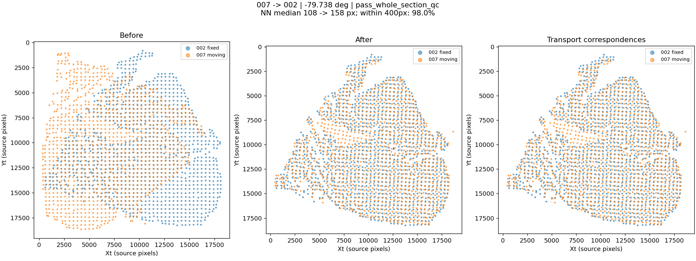

[变换参数](pairs/007_to_002/transform.json)

## 014_to_007 · -13.480827°

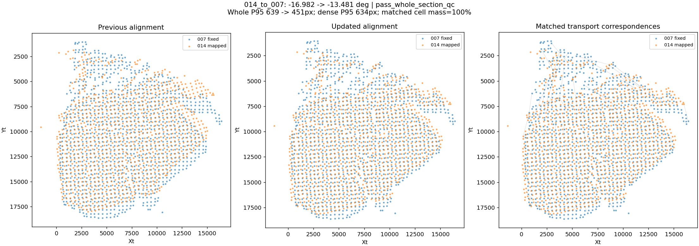

[变换参数](pairs/014_to_007/transform.json)

## 020_to_014 · 8.872776°

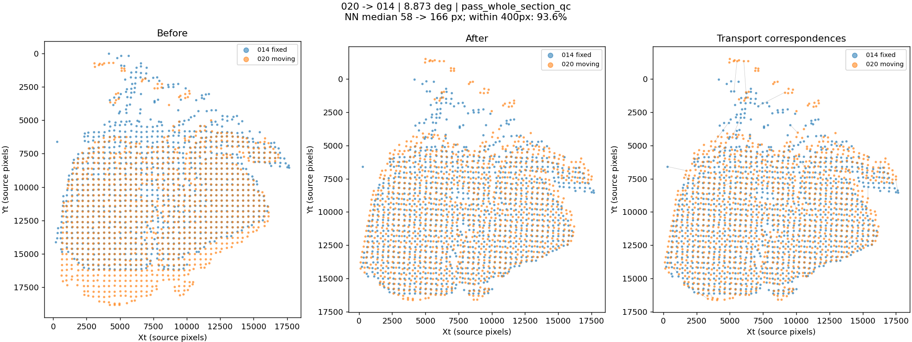

[变换参数](pairs/020_to_014/transform.json)

## 025_to_020 · 0.298069°

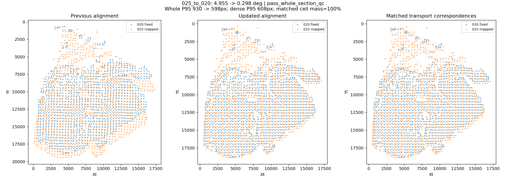

[变换参数](pairs/025_to_020/transform.json)

## 029_to_025 · 2.965127°

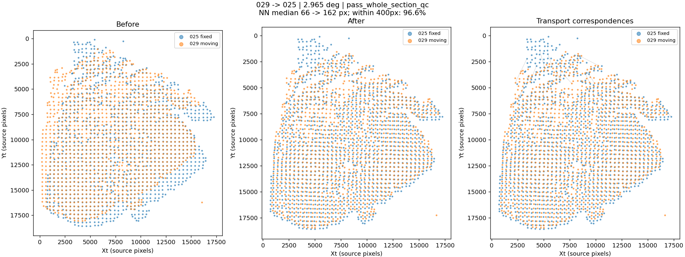

[变换参数](pairs/029_to_025/transform.json)

## 034_to_029 · -1.452748°

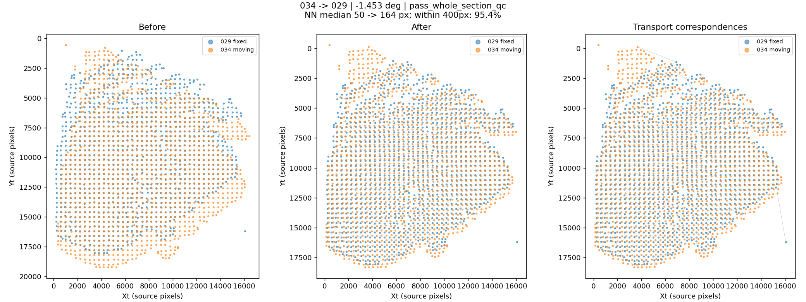

[变换参数](pairs/034_to_029/transform.json)

## 039_to_034 · 1.044891°

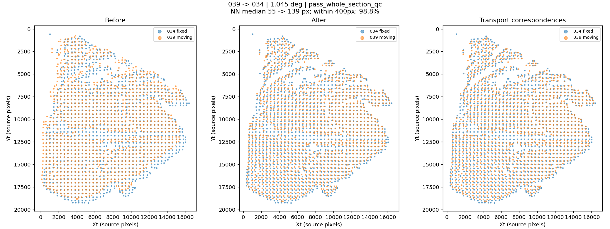

[变换参数](pairs/039_to_034/transform.json)

## 044_to_039 · 3.498096°

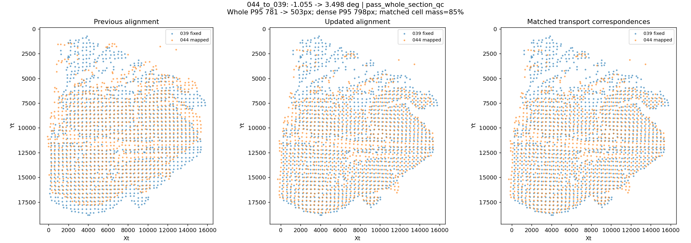

[变换参数](pairs/044_to_039/transform.json)

## 049_to_044 · -7.416653°

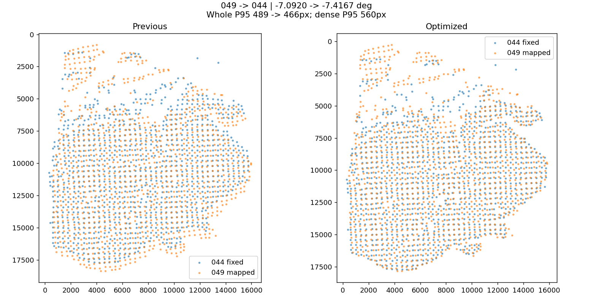

[变换参数](pairs/049_to_044/transform.json)

## 050_to_049 · -0.557422°

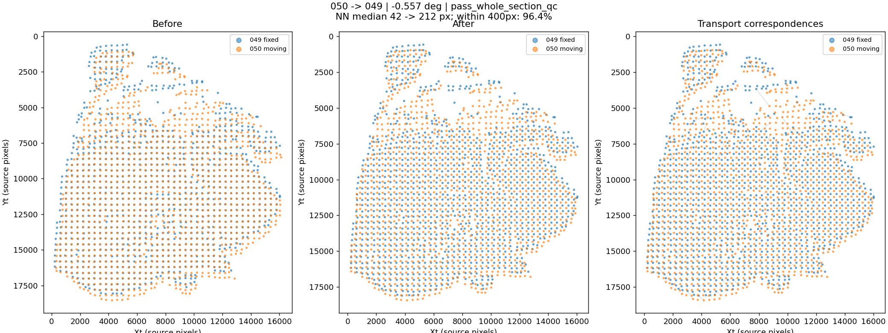

[变换参数](pairs/050_to_049/transform.json)

## 051_to_050 · 1.589903°

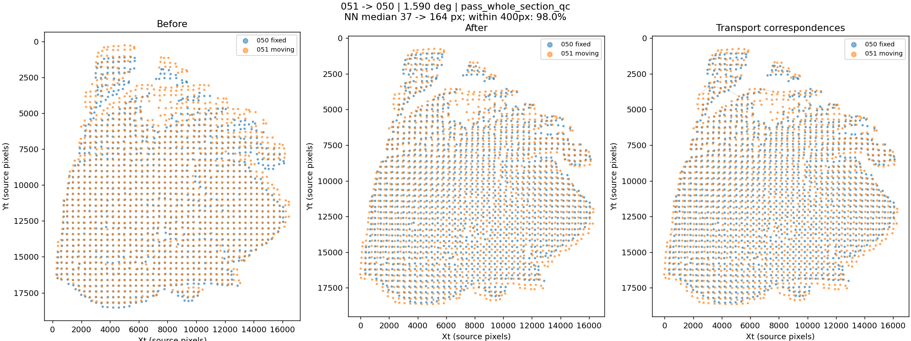

[变换参数](pairs/051_to_050/transform.json)

## 052_to_051 · 3.423022°

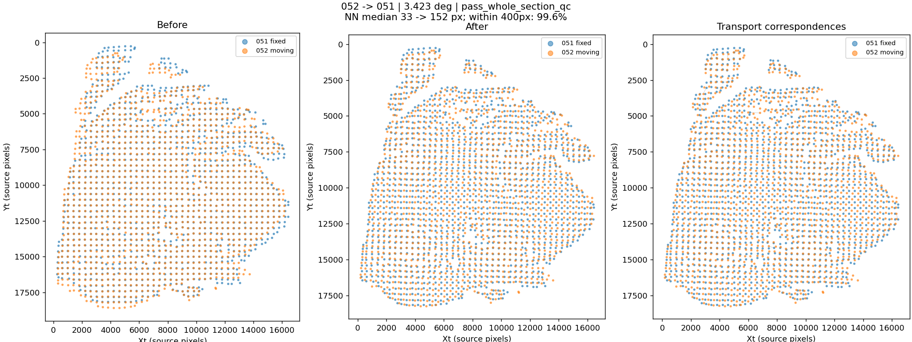

[变换参数](pairs/052_to_051/transform.json)

## 054_to_052 · 14.646871°

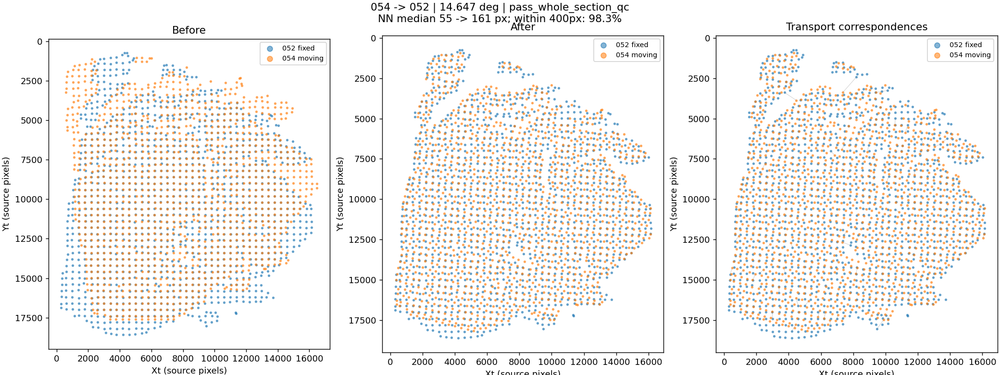

[变换参数](pairs/054_to_052/transform.json)

## 059_to_054 · -12.298353°

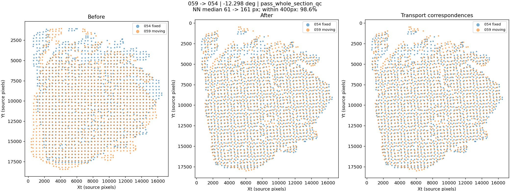

[变换参数](pairs/059_to_054/transform.json)

## 064_to_059 · 1.186426°

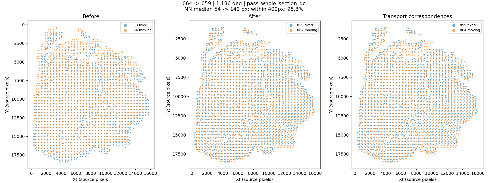

[变换参数](pairs/064_to_059/transform.json)

## 069_to_064 · 3.528679°

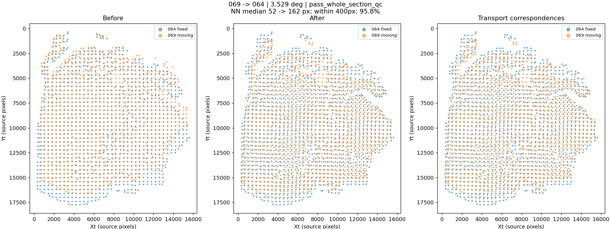

[变换参数](pairs/069_to_064/transform.json)

## 074_to_069 · -14.066141°

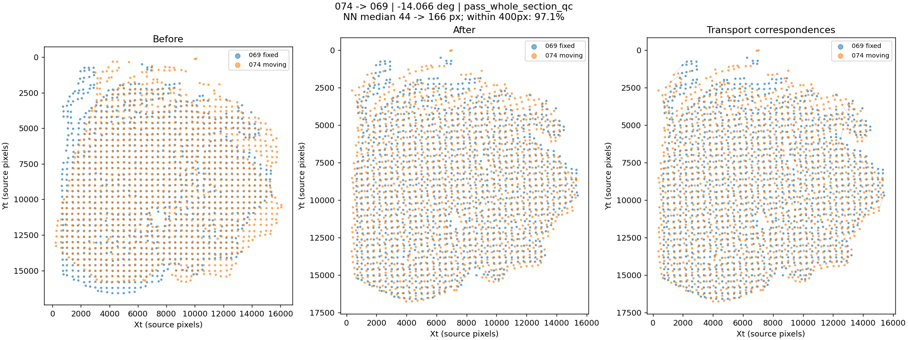

[变换参数](pairs/074_to_069/transform.json)

## 078_to_074 · 14.654401°

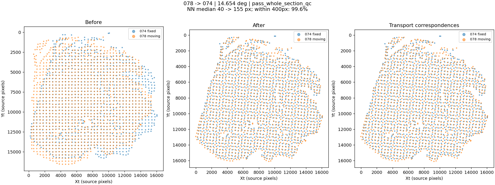

[变换参数](pairs/078_to_074/transform.json)

## 084_to_078 · -11.840264°

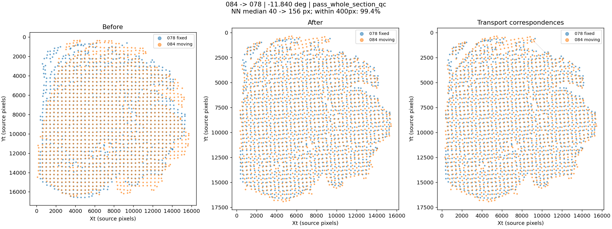

[变换参数](pairs/084_to_078/transform.json)

## 086_to_084 · 12.467530°

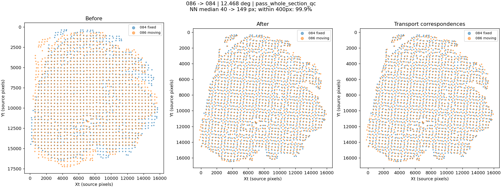

[变换参数](pairs/086_to_084/transform.json)

## 091_to_086 · 0.510069°

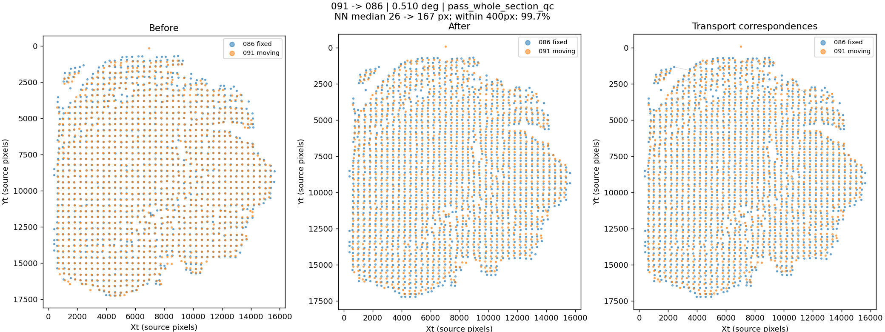

[变换参数](pairs/091_to_086/transform.json)

## 097_to_091 · -2.578493°

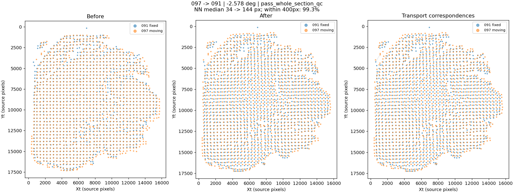

[变换参数](pairs/097_to_091/transform.json)

## 102_to_097 · 2.798066°

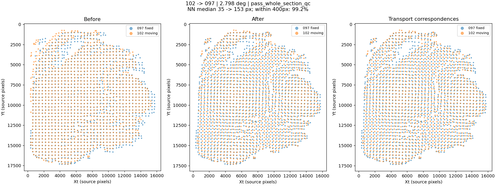

[变换参数](pairs/102_to_097/transform.json)

## 106_to_102 · -8.111449°

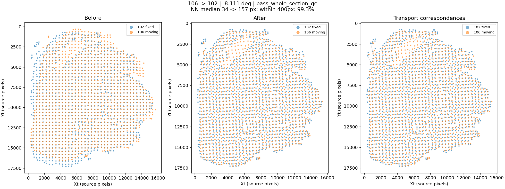

[变换参数](pairs/106_to_102/transform.json)
